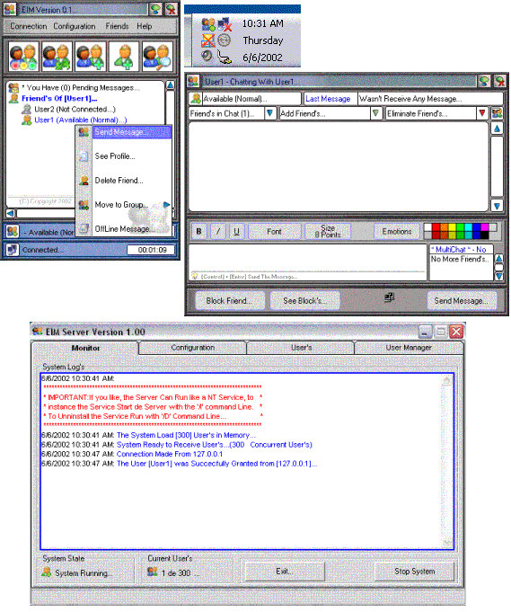



## EIM Version 1\.00

### Description

EIM is a Complete Messanger Aplication (Server and Client Part), like MS Messanger or Yahoo Messanger. - With a Very Nice Look and Fell -.

Some features include: Block Users, Chat with Multiples Users, Event betwen Users, Private Messages, Off-Line Messages, Multilingual Support, send Feelings :-), Etc. Probe it and send me your Comments.... Please if you Like or see this Product Usefull Vote for It ;-)...

I'm Working aroung Include Voice Chat, File Tranfer and Skin Features (May be in Visual Studio .NET), if anyOne like to Join to this project Send me a Mail... (Anyone are Invite, and the programmer Skill that you Have is not the Important)

Thank's - And I'Hope that you Enjoy It !...

*** Don't Forget Vote for EIM !... ***

PD1: BUG's - BUG's !, anything have BUG's please mail me if you Find One...

PD2: Don't Vote Yet? ! -- Come on... Vote...

PD3: Is not an Original CODE but, I'Think that is usefull to Learn VB (The Greatest Languaje in the Word)...

PD4: The System have 2 Users user1 pwd: user1 and user2 pwd: user2 you cand ADD More from the Server Part...

PD5: The Database is in Access 97 Format, but the system work with Access 2000 and 2002 Format, I'you Like can change the format with no problem...

Bye !
 
### More Info
 
At this time was Updated de ZIP File

with the missing OCX (NTSVR.ocx)... Anyway if you

dotn´t use de service, comment the Line

NTService.StartService in Form_Load

Module, and remove the OCX....

or you can Download from the WEB (Is Free - Search in Yahoo)

             |
---                |---
**Submitted On**   |2002-06-06 20:26:50
**By**             |[Pablo Amomo](https://github.com/Planet-Source-Code/PSCIndex/blob/master/ByAuthor/pablo-amomo.md)
**Level**          |Advanced
**User Rating**    |4.9 (337 globes from 69 users)
**Compatibility**  |VB 5\.0, VB 6\.0
**Category**       |[Internet/ HTML](https://github.com/Planet-Source-Code/PSCIndex/blob/master/ByCategory/internet-html__1-34.md)
**World**          |[Visual Basic](https://github.com/Planet-Source-Code/PSCIndex/blob/master/ByWorld/visual-basic.md)
**Archive File**   |[EIM\_Versio91308672002\.zip](https://github.com/Planet-Source-Code/pablo-amomo-eim-version-1-00__1-35540/archive/master.zip)

